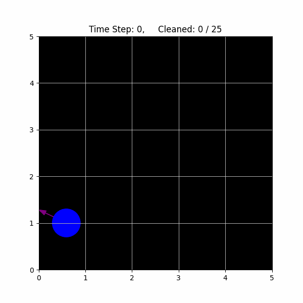
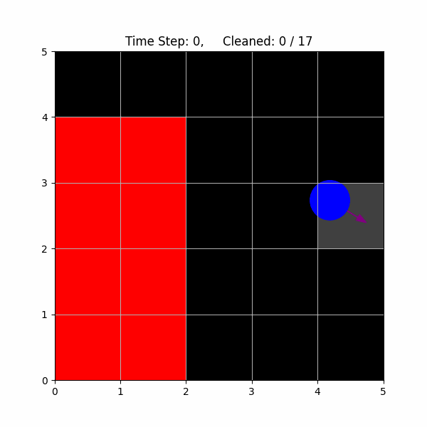
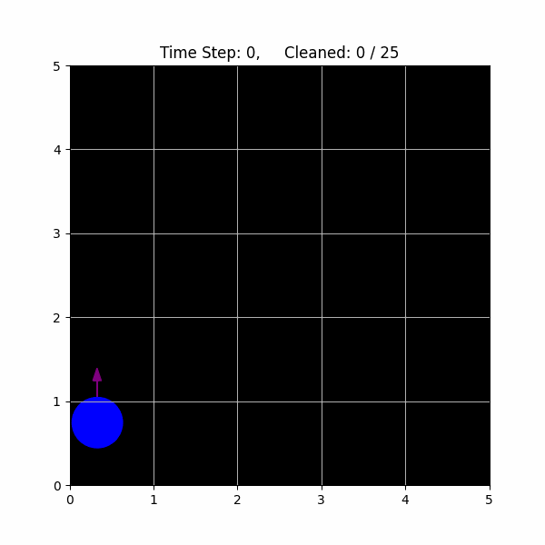

# 🧹 Roomba Random Walk Simulation (MIT 6.0002)
This project simulates a robot vacuum (Roomba) navigating and cleaning a rectangular room. It's part of the problem set from MIT 6.0002: *Introduction to Computational Thinking and Data Science.*

The simulation models: 
* A robot moving randomly through space
* Dirt-covered tiles that are cleaned over time
* Core object-oriented design principles with abstract base classes

## 🧠 Core Classes Implemented

### ✅ `RectangularRoom` (Abstract Class)
Represents a grid of tiles, each with a configurable dirt level.

**Key features:**
- Tracks dirt levels per tile
- Allows cleaning with capped or partial capacity
- Checks if a position is inside the room

### ✅ `Robot` (Abstract Class)
Represents a cleaning robot with:
- Position, direction, speed, and cleaning capacity
- Methods to get/set state
- Designed to be extended by movement strategy subclasses

### ✅ `EmptyRoom` (Subclass of RectangularRoom)
A basic room with no obstacles.
- Overrides `get_num_tiles` using total `width x height`
- `is_position_valid` defers directly to `is_position_in_room`

### ✅ `FurnishedRoom` (Subclass of RectangularRoom)
A room that includes randomly placed furniture. 
- Furniture is stored as a list of tile coordinates
- `is_position_valid` is overridden to exclude furnished tiles.
- Implements furniture-safe random position generation
- Uses wrapper methods (`is_tile_furnished`, `is_position_furnished`) for clarity

### ✅ `StandardRobot` (Subclass of Robot)
Implements the baseline movement behavior of a robot.
- Moves in its current direction by speed units
- Cleans the tile it lands on with its full capacity
- If new position is invalid (e.g., off-grid or on furniture), rotates randomly

### ✅ `FaultyRobot` (Subclass of Robot)
A Standard Robot with a probabilistic error to become faulty.
- With probability `p`, the robot gets faulty at each time step
- When faulty, it does **not** clean and randomly changes direction
- Faults are visualized in orange in the simulation for clarity.
- Method `gets_faulty()` encapsulates the probability check

### Honorary Class: 🎥The Visualization Overhaul: `ColabRobotVisualizer`
To enable simulation in Colab, I replaced the original `RobotVisualization` (Tkinter-based) with a custom `ColabRobotVisualizer` using `matplotlib`.

Key features:
- Dynamic grid plotting with robot positions and directions
- Cleaned tiles fade from black to white based on dirt level
- Furniture tiles rendered in red
- Faulty robots flash orange
- Option to **record simulation as a GIF**
- Arrow indicators show real-time robot direction

This change not only modernized the interface but helped debug and interpret robot behaviors more intuitively.
  
---

## 🔧 Implemented Methods

- `clean_tile_at_position`
- `get_dirt_amount`
- `get_num_cleaned_tiles`
- `is_tile_cleaned`
- `is_tile_furnished` (FurnishedRoom only)
- `is_position_furnished` (FurnishedRoom only)
- `is_position_in_room`
- `get_robot_position`, `set_robot_position`
- `get_robot_direction`, `set_robot_direction`
- `get_random_postion` (for both Empty and Furnished rooms)
- `get_num_tiles` (customized per subclass)
- `gets_faulty`, `set_faulty_probability` (FaultyRobot only)
- `update_position_and_clean` (for both Standard and Faulty Robot)

These methods form the foundation for simulating robot cleaning behavior across various environments, inclduing rooms with and without obstacles.

---

## 🧱 Data Structures

- The room is backed by a dictionary: `{(m, n): dirt_amount}`
- Furniture tiles are stored in a list: `[(x,y), ...]`
- Floating-point positions are mapped to tiles using `int(x), int(y)`
- Dirt is non-negative and clipped when cleaned beyond available amount
- Robot positions are stored as floating-point `Position` objects to support sub-tile precision
- Robot direction is a float (in degrees 0–360) used for movement logic and visual arrows
- The visualizer uses tile state (clean/furniture/dirt level) to assign color dynamically
- Frames for visualization are optionally saved as PNGs in a `frames/` directory and compiled into GIFs
- Faulty behavior is determined by a class-level probability `p` (adjustable via `set_faulty_probability()`)

---

## 🔍 Design Insight: Abstract Classes

This project uses **abstract classes** (`RectangularRoom` and `Robot`) to enforce structure while allowing flexible implementation. Abstract classes define the essential methods and attributes all subclasses must have but leave specific behaviors—like how a robot moves or how a room is constructed—to be defined by subclasses.

This design pattern helped me:

* Focus on shared state and behavior while isolating differences
* Create reusable code scaffolding
* Understand how simulation components (like rooms and robots) can be extended for more complex behavior (e.g., furnished rooms, faulty robots)

By implementing the base logic in abstract classes and deferring custom behavior to subclasses, I practiced building systems that scale in complexity without becoming chaotic.

---

## 📎 Note on Appendix (Subproblems 5 & 6)

While subproblems 5 and 6 were completed, they required computationally expensive simulations (e.g. 20 trials across 10 robot counts in a 20×20 room). As a result, I moved supporting functions, extended plots, and exploratory code to an appendix section to avoid slowing down the core repo. These experiments explore performance tradeoffs between robot types and include helpful visualizations and simulation metrics.

---

## 🛠️ Skills Used

- Object-Oriented Programming (OOP)
- Abstract class design
- Floating-point vs grid-based coordinate mapping
- Randomized simulation setup
- Data structure design (dict-based tile tracking)
- Custom visualization using `matplotlib` for animation
- GIF generation and frame management with `PIL`
- Performance benchmarking of stochastic simulations
- Methodical debugging and testing
- Git/GitHub version control and documentation

---

## 📚 Course Reference

This project is part of [MIT 6.0002 – Introduction to Computational Thinking and Data Science](https://ocw.mit.edu/courses/electrical-engineering-and-computer-science/6-0002-introduction-to-computational-thinking-and-data-science-fall-2016/)

---
## 🎞️ Visual Demos
|Empty Room | Furnished Room | Faulty Robot|
| - | -|-|
| |  |  |

## 🧠 Personal Note

This project gave me a chance to explore simulation design using OOP. Instead of jumping straight to implementation, I practiced architectural thinking—especially how data and behavior interact in layered systems. I paid close attention to floating-point precision, dictionary-based grid tracking, and how abstract classes enforce structure while allowing flexibility.

This is part of my broader summer goal to deepen my algorithmic thinking, system design, and preparation for machine learning and cancer bioinformatics work.
